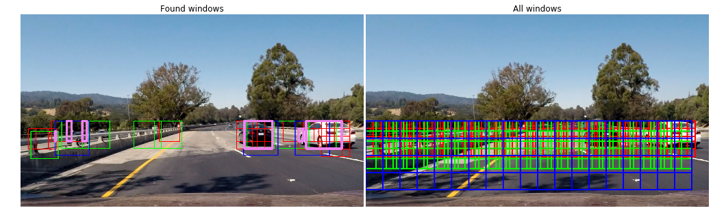

# Vehicle Detection Project

The goals / steps of this project are the following:

* Perform a Histogram of Oriented Gradients (HOG) feature extraction on a labeled training set of images and train a classifier Linear SVM classifier
* Optionally, you can also apply a color transform and append binned color features, as well as histograms of color, to your HOG feature vector. 
* Note: for those first two steps don't forget to normalize your features and randomize a selection for training and testing.
* Implement a sliding-window technique and use your trained classifier to search for vehicles in images.
* Run your pipeline on a video stream (start with the test_video.mp4 and later implement on full project_video.mp4) and create a heat map of recurring detections frame by frame to reject outliers and follow detected vehicles.
* Estimate a bounding box for vehicles detected.

The approach of taking HOG image features and using them in a linear SVM for classification is not new, it already has been presented at the *Conference on Computer Vision and Pattern Recognition* (CVPR) in 2005 (https://hal.inria.fr/inria-00548512/document). In addition to this approach also considers spatial features (resized image) and color histogram features in order to make more robust detections.

The whole code can be found in the jupyter notebook [vehicle_detection_and_tracking.ipynb](./vehicle_detection_and_tracking.ipynb)

[//]: # (Image References)
[image1]: ./examples/car_not_car.png
[image3]: ./examples/sliding_windows.jpg
[image4]: ./examples/sliding_window.jpg
[image5]: ./examples/bboxes_and_heat.png
[image6]: ./examples/labels_map.png
[image7]: ./examples/output_bboxes.png

## Histogram of Oriented Gradients (HOG)

I started by reading in all the `vehicle` and `non-vehicle` images. From the dataset which is a mix between the KITTI, GTI and Udacity datasets.
Here is an example of one of each of the `vehicle` and `non-vehicle` classes:

![alt text][image1]

I then explored different color spaces and different `skimage.hog()` parameters (`orientations`, `pixels_per_cell`, and `cells_per_block`).  I grabbed random images from each of the two classes and displayed them to get a feel for what the `skimage.hog()` output looks like.

Here is an example using the `HLS` color space and HOG parameters of `orientations=8`, `pixels_per_cell=(8, 8)` and `cells_per_block=(2, 2)` which seemed to work very well with the given data:


**Choosing HOG parameters**

I experimented with a number of different combinations of color spaces and HOG parameters and trained a linear SVM using different combinations of HOG features extracted from the color channels. Having used `HLS` colorspace in previous projects I right away settled to use it in this project as well, because each of the `HLS` channels seem to capture preserve shapes even in different light conditions very well.
Playing with the orientation bins I found that going from 9 to 12 didn't help much to improve accuracy in the SVM classification, it only blew up the feature vecture, so I stuck with `9` orientation bins.
Similarly, changing `pixels_per_cell=(8,8)` and `cells_per_block=(2,2)` to other values did not improve results much, which is why left those values to one we already used in class.

## Using spatial and histogram image features

Another method to directly capture the input data is to just scale the input images down to a fairly small size and flatten the resulting pixels into a vector. It's a very small representation of the original image but it still contains important cues of the content.


Particularly in the case of classifying cars it makes sense to add color cues into the feature vector. This is done by computing a histogram for each color channel and flatten all bins into a vector. In my case I used 32 bins of each channel.


## Using the feature vector to train a linear SVM
 
In the course of this project I experimented with SVMs using an RBF kernel as well as a linear SGDClassifier which uses stochastic gradient descent and a linear SVM like loss function.
Unfortunately the RBF SVM was way too slow during training and predicting, so I abolished using it. 
The SGDClassifier however didn't score as well as the linear SVM but seemed to produce less false positive detections.


## Sliding Window Search

In my solution the sliding window search is implemented on top of the subsampling of the HOG features for the whole search area, because calculating HOG features for each and every window is too computationally expensive.
I decided to use three different window sizes 

**Choosing parameters**

I chose to use three window scales and along with them different y ranges where the sliding windows operate.
Because cars appearing smaller will most likely be farer in the distance, so only searching in the upper y range for small appearing cars already significantly reduces the amount of windows.
Here is my configuration:
```python
# Min and max in y to search in slide_window()
y_start_stop    = [[400, 580], [400, 650], [400, 720]]
scales          = [  1.2     ,  1.6       ,   2.0    ]
cells_per_steps = [    3     ,    3       ,     4    ]
```
Resulting in 123 windows for scale 1.2, 90 windows for scale 1.6 and 54 windwos for scale 2.0.
So 267 search windows in total.
In the following image all windows are shown scale 1.2 windows in red, scale 1.6 windows in green and scale 2.0 windows in blue:


## Vehicle detection pipeline examples

In the following examples you can see in the left image all the areas where a vehicle was detected and the right image shows the grid of search windows.
The color coding works this way:
* Red: scale 1.2 windows
* Green: scale 1.6 windows
* Blue: scale 2.0 windows
* Violet: accumulated heatmap detected window (see explanation below)





## Filtering false positives and combining overlapping bounding boxes

I collected the positions of positive detections in a list and from the positive detections I created a heatmap and then thresholded that map to identify vehicle positions. I then used `scipy.ndimage.measurements.label()` to identify individual blobs in the heatmap. I then assumed each blob corresponded to a vehicle. I constructed bounding boxes to cover the area of each blob detected.  
Here is an example for a single image:


For videos I collected positive detections across `nr_frames = 20` in a queue and created a heat map from that to find the areas 
where positive detections were accumulated.

**Here are six frames and their corresponding heatmaps:**

![alt text][image5]

**Here is the output of `scipy.ndimage.measurements.label()` on the integrated heatmap from all six frames:**
![alt text][image6]

**Here the resulting bounding boxes are drawn onto the last frame in the series:**
![alt text][image7]


## Video Implementation

I tested the vehicle detection pipeline on the following videos:
* [project_video.mp4](./videos_output/project_video.mp4)
* [test_video.mp4](./videos_output/test_video.mp4)  

## Discussion

In this project it was really tough to find the right balance between accuray and computation time.
In the end I settled with a simple linear SVM and a feature vector of length 6156, which allowed to process approx. 1 fps.
Not very fast, I've to say, comparing it to recent advancements in deep learning like [YOLO2](https://pjreddie.com/darknet/yolo) which allows processing with around 40-60 fps on images with similar size. Of course this solution is highly optimized for running on a GPU but still impressive.
I think my pipeline has a lot of potential to be parallized and therefore optimized to achive a way higher framerate, after all there is a lot of independent stuff running sequentially which can be easily run in parallel.

My pipeline still lacks the following things:
* I didn't optimize the SVM training by hand-selecting features within the time-series training images, which leads to considerable overfitting, I assume the precision of my classifier to be rather low , whereas the recall seems to be high, which is evident by the accuracy result on the test set.
* Pipeline is slow, needs parallel optimization
* False-positive filtering on video is not very effective yet, it's still a WIP because of the tight deadline
* Effectively I'm not tracking vehicles, this still needs to be implemented
